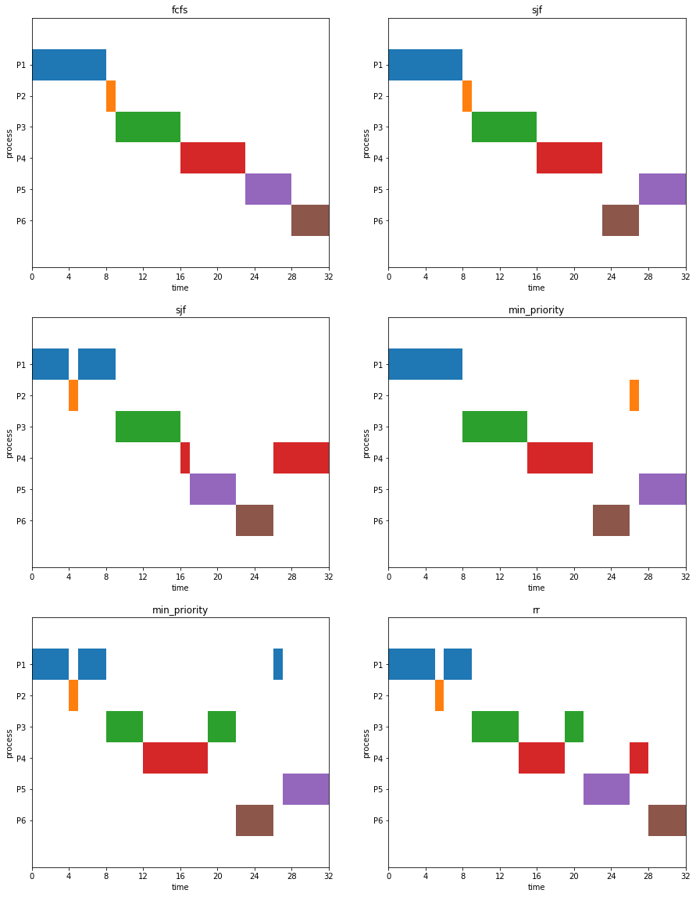

# CPU Scheduling Algorithm and its Gnatt's Chart

# Description

A f****** course asked me to draw the Gnatt's charts according to specific arrival time, burst time, priority of some processes so I made this program to answer it.

# How

Requirement: Python3 with matplotlib and pandas installed

Available CPU scheduling algorithm: fcfs, sjf, rr, priority(min or max)

Use CPUScheduler to find the progress detail, summary and use ProcessGnattChart to plot the Gnatt's Chart

# Example

1. Consider the following processes:

| Process | Arrival Time | Burst Time | Priority |
|:-------:|:------------:|:----------:|:--------:|
|    P1   |       0      |      8     |     5    |
|    P2   |       4      |      1     |     4    |
|    P3   |       8      |      7     |     2    |
|    P4   |      12      |      7     |     1    |
|    P5   |      17      |      5     |     6    |
|    P6   |      21      |      4     |     3    |

Draw Gantt charts for the scheduling algorithms 
* FCFS, 
* SJF, 
* SRTF, 
* Non-Preemptive priority (smaller priority higher priority), 
* Preemptive priority, 
* RR (time quantum = 5)

Solution with the code

```python
cpus = CPUScheduler(burst_time = [8, 1, 7, 7, 5, 4],
                    arrival_time = [0, 4, 8, 12, 17, 21],
                    priority = [5, 4, 2, 1, 6, 3],
                    pid = ['P1', 'P2', 'P3', 'P4', 'P5', 'P6']) #fit the data
    
fig, gnt = plt.subplots(ncols = 2, nrows = 3, figsize = (15, 15))
pgc = ProcessGnattChart()
for i, (algo, pre, tq) in enumerate(zip(['fcfs', 'sjf', 'sjf', 'min_priority', 'min_priority', 'rr'], 
                                        [False, False, True, False, True, False], 
                                        [1, 1, 1, 1, 1, 5])):
  prog, summary = cpus.transform(scheme = algo, preemptive = pre, time_quantum = tq)
  pgc.transform(prog, gnt = gnt[i // 2, i % 2], title = algo)
  plt.show(fig)
```

should result in


2. Consider the following processes. Find the turnaround time of each process for the scheduling algorithm SRTF:

| Process | Arrival Time | Burst Time |
|:-------:|:------------:|:----------:|
| P1 | 0 | 5 |
| P2 | 1 | 3 |
| P3 | 2 | 3 |
| P4 | 4 | 1 |

```
import pandas as pd
cpus = CPUScheduler(burst_time = [5, 3, 3, 1],
                    arrival_time = [0, 1, 2, 4], 
                    pid = ['P1', 'P2', 'P3', 'P4'])
prog, summ = cpus.transform(scheme = 'sjf', preemptive = True, time_quantum = 1)
print(pd.DataFrame(summ))
```

should result in

|  | Response Time | Turnaround Time | Waiting Time |
|:--:|:-------------:|:---------------:|--------------|
| P1 | 1 | 12 | 7 |
| P2 | 3 | 3 | 0 |
| P3 | 6 | 6 | 3 |
| P4 | 1 | 1 | 0 |

Now we know the answer.


